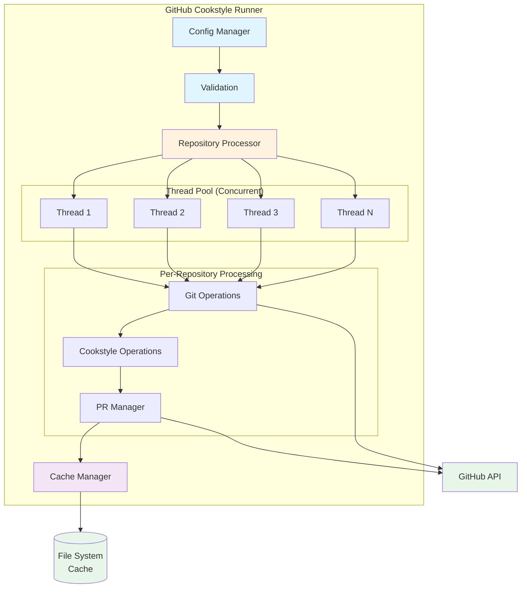

# Architecture

Overview of the GitHub Cookstyle Runner architecture and design decisions.

## High-Level Architecture



## Core Components

### 1. Configuration Management

**Files**:

- `lib/cookstyle_runner/configuration.rb`
- `lib/cookstyle_runner/settings_validator.rb`
- `config/validators/settings_validator.rb`

**Responsibilities**:

- Load configuration from environment variables and YAML files
- Validate configuration schema
- Provide type-safe access to settings

**Design Decisions**:

- Environment variables take precedence over config files
- Validation happens at startup (fail-fast)
- Uses `Config` gem for YAML configuration
- Uses `dry-schema` for validation

### 2. Authentication

**Files**:

- `lib/cookstyle_runner/authentication.rb`

**Responsibilities**:

- Generate GitHub App JWT tokens
- Create installation access tokens
- Provide authenticated URLs for Git operations

**Design Decisions**:

- Uses GitHub App authentication (more secure than PATs)
- Tokens are short-lived and regenerated as needed
- Supports GitHub Enterprise via custom API root

### 3. Repository Discovery

**Files**:

- `lib/cookstyle_runner/repository_finder.rb`

**Responsibilities**:

- Search GitHub for repositories by topics
- Filter repositories based on configuration
- Handle pagination

**Design Decisions**:

- Topic-based discovery for flexibility
- Supports explicit repository filtering
- Handles large organization with pagination

### 4. Repository Processing

**Files**:

- `lib/cookstyle_runner/repository_processor.rb`

**Responsibilities**:

- Orchestrate processing of individual repositories
- Manage thread pool for parallel processing
- Handle errors and retries

**Design Decisions**:

- Multi-threaded for performance
- Process isolation (separate directory per repo)
- Retry logic for transient failures
- Comprehensive error handling

### 5. Git Operations

**Files**:

- `lib/cookstyle_runner/git.rb`

**Responsibilities**:

- Clone repositories
- Create branches
- Commit changes
- Push to remote

**Design Decisions**:

- Uses authenticated HTTPS URLs
- Shallow clones for performance
- Automatic cleanup of working directories
- Handles authentication failures gracefully

### 6. Cookstyle Operations

**Files**:

- `lib/cookstyle_runner/cookstyle_operations.rb`

**Responsibilities**:

- Run Cookstyle with auto-correction
- Parse JSON output
- Categorize offenses (auto-correctable vs manual)
- Generate PR/issue descriptions

**Design Decisions**:

- JSON output for structured parsing
- Separate auto-correctable and manual offenses
- Detailed offense reporting
- Version tracking

### 7. Pull Request Management

**Files**:

- `lib/cookstyle_runner/github_pr_manager.rb`

**Responsibilities**:

- Create pull requests
- Create issues (for manual fixes)
- Apply labels
- Generate PR descriptions

**Design Decisions**:

- Separate PRs for auto-correctable vs manual fixes
- Rich PR descriptions with offense details
- Configurable titles and labels
- Idempotent (checks for existing PRs)

### 8. Cache System

**Files**:

- `lib/cookstyle_runner/cache.rb`
- `lib/cookstyle_runner/cache_entry.rb`

**Responsibilities**:

- Track repository state (commit SHA)
- Store offense counts
- Manage cache expiration
- Provide cache statistics

**Design Decisions**:

- JSON file-based storage (simple, portable)
- Time-based expiration
- SHA-based change detection
- Atomic writes to prevent corruption

## Data Flow

### Typical Execution Flow

1. **Startup**:
   - Load configuration
   - Validate settings
   - Initialize logger
   - Authenticate with GitHub

2. **Discovery**:
   - Search for repositories by topics
   - Apply filters
   - Load cache

3. **Processing** (per repository, in parallel):
   - Check cache (skip if unchanged and fresh)
   - Clone/update repository
   - Run Cookstyle with auto-correction
   - Parse results
   - If changes:
     - Create branch
     - Commit changes
     - Push branch
     - Create PR
   - Update cache

4. **Completion**:
   - Save cache
   - Log summary statistics
   - Exit

## Design Patterns

### 1. Service Objects

Each major operation is encapsulated in a service object:

- `RepositoryProcessor`
- `GitHubPRManager`
- `CookstyleOperations`

**Benefits**:

- Single Responsibility Principle
- Easy to test
- Clear interfaces

### 2. Value Objects

Immutable objects for data:

- `CacheEntry`
- `Git::RepoContext`

**Benefits**:

- Thread-safe
- Predictable behavior
- Easy to reason about

### 3. Dependency Injection

Dependencies are injected, not created:

```ruby
def initialize(logger, github_client, cache)
  @logger = logger
  @github_client = github_client
  @cache = cache
end
```

**Benefits**:

- Testable (mock dependencies)
- Flexible (swap implementations)
- Clear dependencies

### 4. Strategy Pattern

Different strategies for cache management, PR creation, etc.

**Benefits**:

- Extensible
- Configurable behavior
- Open/Closed Principle

## Concurrency Model

### Thread Pool

- Fixed-size thread pool (configurable)
- One repository per thread
- Thread-safe cache access
- Isolated working directories

### Synchronization

- Cache writes are synchronized
- GitHub API client is thread-safe
- Logger is thread-safe

### Error Handling

- Errors in one thread don't affect others
- Failed repositories are logged and skipped
- Retry logic for transient failures

## Performance Considerations

### Optimization Strategies

1. **Caching**:
   - Skip unchanged repositories
   - Reduce API calls
   - Faster subsequent runs

2. **Parallel Processing**:
   - Multiple repositories simultaneously
   - CPU-bound work parallelized

3. **Shallow Clones**:
   - Only clone latest commit
   - Faster cloning

4. **Efficient API Usage**:
   - Batch operations where possible
   - Respect rate limits

### Bottlenecks

1. **GitHub API Rate Limits**:
   - 5,000 requests/hour
   - Mitigated by caching

2. **Network I/O**:
   - Repository cloning
   - API requests
   - Mitigated by parallelism

3. **Disk I/O**:
   - Repository clones
   - Mitigated by cleanup

## Security Considerations

### Secrets Management

- GitHub App private key stored securely
- Never logged or exposed
- Short-lived access tokens

### Isolation

- Each repository in separate directory
- No cross-repository contamination
- Cleanup after processing

### Least Privilege

- Minimal GitHub App permissions
- Read-only where possible
- Write only to specific branches

## Testing Strategy

### Unit Tests

- Test individual methods
- Mock external dependencies
- Fast execution

### Integration Tests

- Test component interactions
- Use VCR for API mocking
- Slower but comprehensive

### Test Coverage

- Aim for >90% coverage
- Focus on critical paths
- Test error conditions

## Future Enhancements

### Planned Features

1. **Webhook Support**:
   - Trigger on repository events
   - Real-time processing

2. **Metrics and Monitoring**:
   - Prometheus metrics
   - Grafana dashboards

3. **Pluggable Storage**:
   - Redis cache backend
   - Database storage

4. **Advanced Filtering**:
   - Exclude repositories
   - Custom search queries

5. **Dry Run Mode**:
   - Preview changes without creating PRs

## Contributing

See [Contributing Guide](contributing.md) for development setup and guidelines.
